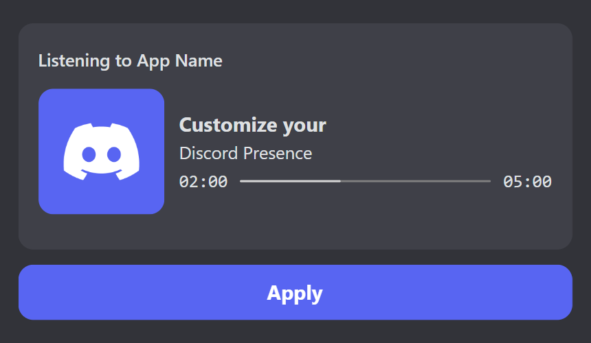
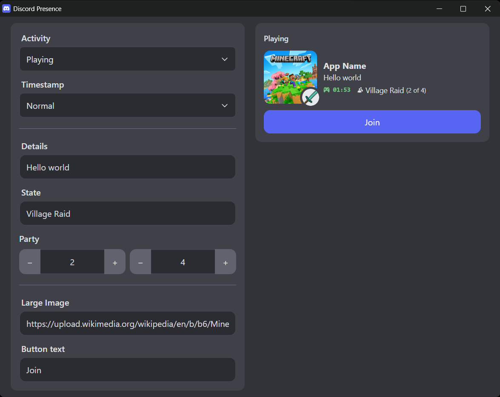
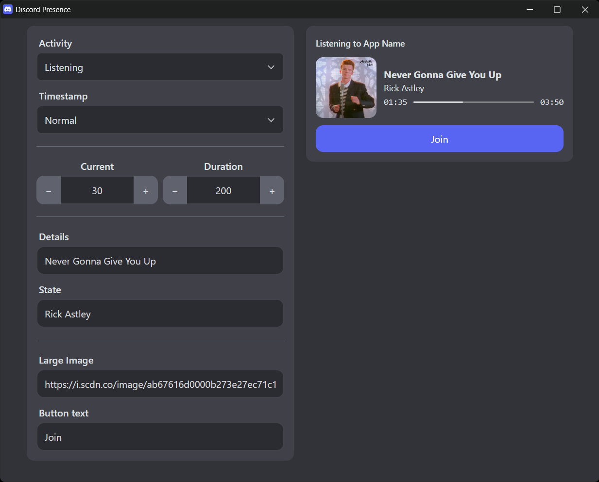

# Discord Presence

### Customize your Discord Activity as you wish

A cross-platform web application that lets you to customize your Discord Rich Presence. 
Supports a real-time preview so you can instantly see how your status will appear.

Perfect for developers, gamers, and creators who want to personalize their Discord activity.

	
More images

	
	

### Install:
1. Download app from [Releases](https://github.com/SuperZombi/Discord-Presence/releases/).
2. Create new application on [Discord Developer Portal](https://discord.com/developers/applications).
3. Copy the Application ID.

### Supported options:
- Activity:
  - Playing
  - Listening
  - Watching
- Timestamp:
  - Normal
  - Progressbar
  - Local time
- State
  - State URL
- Details
  - Details URL
- Large image
  - Large image tooltip
- Small image
  - Small image tooltip
- Party size
- Buttons

> [!WARNING]
> Discord does not display buttons to the user who set them. 
> However, your friends will be able to see them normally.

### See also:
- [Discord Music Status](https://github.com/SuperZombi/Discord-Music-Status)

## 💲Donate
<table>
  <tr>
    <td>
       
    </td>
    <td>
      <a href="https://donatello.to/super_zombi">Donatello</a>
    </td>
  </tr>
  <tr>
    <td>
       
    </td>
    <td>
      <a href="https://www.donationalerts.com/r/super_zombi">Donation Alerts</a>
    </td>
  </tr>
</table>

Made with ❤️
